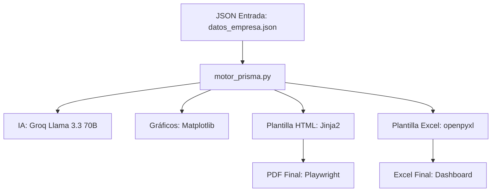

# Documentación Técnica del Sistema PrismaHR Refactor (v6.0)

Este documento describe la arquitectura y el funcionamiento del motor **PrismaHR**, un sistema de evaluación de talento impulsado por IA que genera informes ejecutivos en PDF y Excel.

## 1. Resumen de la Arquitectura
El sistema utiliza un enfoque modular y asíncrono para procesar grandes volúmenes de datos con una latencia mínima.



> [!IMPORTANT]
> El sistema actual (V6) ya no utiliza archivos Excel de entrada ni el antiguo `diccionario_perfiles.json`. Ahora todo el conocimiento y los datos residen en un único archivo JSON centralizado.

---

## 2. Componentes Principales

### 2.1 motor_prisma.py
Es el orquestador central. Sus funciones incluyen:
- **Carga de Datos**: Lee `datos_empresa.json`.
- **Cálculo de Compatibilidad**: Compara las dimensiones del usuario con los pesos del perfil objetivo de la empresa.
- **Orquestación IA**: Lanza 6 peticiones asíncronas a Groq para generar el contenido narrativo.
- **Generación Documental**: Gestiona la creación de PDFs y Excels.

### 2.2 datos_empresa.json (Estructura de Datos)
> [!NOTE]
> Este es el núcleo de información del sistema. Define tanto la configuración de la empresa como los datos de los evaluados.

**Estructura:**
- `empresas`: Diccionario indexado por ID de empresa.
  - `info`: Nombre, sector, colores corporativos y logo.
  - `pesos_perfil_objetivo`: Valores 0-10 para las 7 dimensiones (Adaptabilidad, Comunicación, Creatividad, Disciplina, Empatía, Iniciativa, Resiliencia).
  - `clientes`: Lista de personas evaluadas con sus puntuaciones (0-100) y frases de observación.

### 2.3 Sistema de Plantillas Híbrido
- **PDF**: Usa `plantilla_radar.html` con Jinja2 y Playwright. Permite diseños de alta fidelidad con CSS moderno.
- **Excel**: Usa `plantilla_excel.xlsx`. El sistema busca marcadores de texto (ej: `[CHART_RADAR]`, `[LOGO_EMPRESA]`) e inyecta dinámicamente los gráficos y datos.

### 2.4 Generación Narrativa (Las 6 Peticiones a Groq)
El motor lanza 6 peticiones asíncronas simultáneas para transformar los datos numéricos en narrativa ejecutiva. Todas utilizan el modelo **Llama 3.3 70B**.

| Petición | Datos Enviados (Input) | Contenido Generado (Output) | Destino en PDF (`plantilla_radar.html`) |
| :--- | :--- | :--- | :--- |
| **1. Bloques Narrativos** | Nombre, Perfil, Score y **Frases Predeterminadas**. | 3 bloques: Fortalezas, Liderazgo y Veredicto Final. | `{{ analisis_bloque_1/2/3 }}` |
| **2. Justificación** | Nombre, Perfil y Score de compatibilidad. | Resumen ejecutivo (2-3 frases) que defiende el veredicto. | `{{ desc_recom }}` |
| **3. Fortalezas Clave** | Perfil objetivo y dimensiones técnicas. | Lista de las 3 habilidades más destacadas del evaluado. | Listas dinámicas de la pág. 1. |
| **4. Puntos Críticos** | Scores de las 7 dimensiones (foco en las más bajas). | 2 áreas de mejora urgente y atención prioritaria. | `{{ puntos_criticos }}` (Pág. 2) |
| **5. Catalizadores** | Scores de las 7 dimensiones (foco en las más altas). | 2 oportunidades de crecimiento y desarrollo estratégico. | `{{ catalizadores_crecimiento }}` (Pág. 2) |
| **6. Alerta de Riesgo** | Resiliencia, Empatía y **Frases Predeterminadas**. | Nivel de riesgo (Bajo/Medio/Alto) de burnout o fuga. | Área de Evaluación de Riesgos. |

> [!IMPORTANT]
> Las **Frases Predeterminadas** son críticas: actúan como el "ancla de verdad" para la IA, obligándola a que toda la narrativa generada sea coherente con las observaciones manuales del evaluador.


---

## 3. Flujo de Ejecución

1. **Carga**: Se parsea el archivo JSON.
2. **Análisis**: Se calculan los percentiles comparando al usuario con su equipo (contextualización).
3. **Generación IA**: Se consulta a Groq para:
   - Análisis de Fortalezas y Liderazgo.
   - Puntos Críticos y Catalizadores de Crecimiento.
   - Alerta de Riesgo (Burnout/Fuga de talento).
4. **Renderizado**: Se generan los gráficos con Matplotlib y se inyectan en las plantillas.
5. **Exportación**: Se guardan los resultados en `Salida_PDF/` y `Salida_Excel/`.

---

## 4. Tecnologías Clave

| Tecnología | Propósito |
| :--- | :--- |
| **Groq (Llama 3)** | Motor de narrativa y razonamiento ultra-rápido. |
| **Playwright** | Generación de PDFs de alta fidelidad desde HTML. |
| **Matplotlib** | Generación de gráficos analíticos (Radar, Barras, Scatter). |
| **Openpyxl** | Manipulación de plantillas Excel corporativas. |
| **Pydantic v2** | Validación estricta de la estructura del JSON. |

---

## 5. Instrucciones de Uso

> [!TIP]
> Asegúrate de tener configurado tu archivo `.env` con la clave `GROQ_API_KEY`.

```bash
# Ejecutar el procesamiento por lotes desde el JSON
python motor_prisma.py
```

El sistema detectará automáticamente los datos en `datos_empresa.json` y generará un informe PDF e informe Excel para cada persona, además de un consolidado para el equipo.